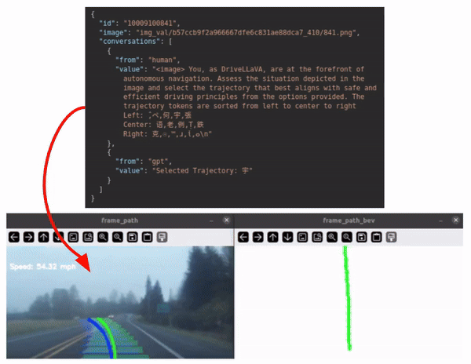
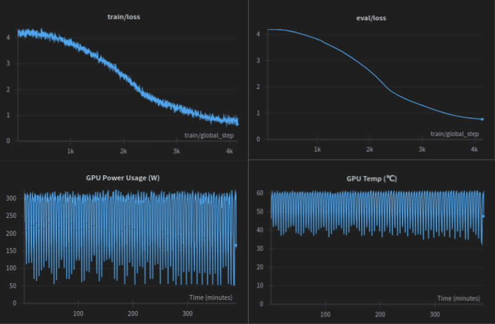
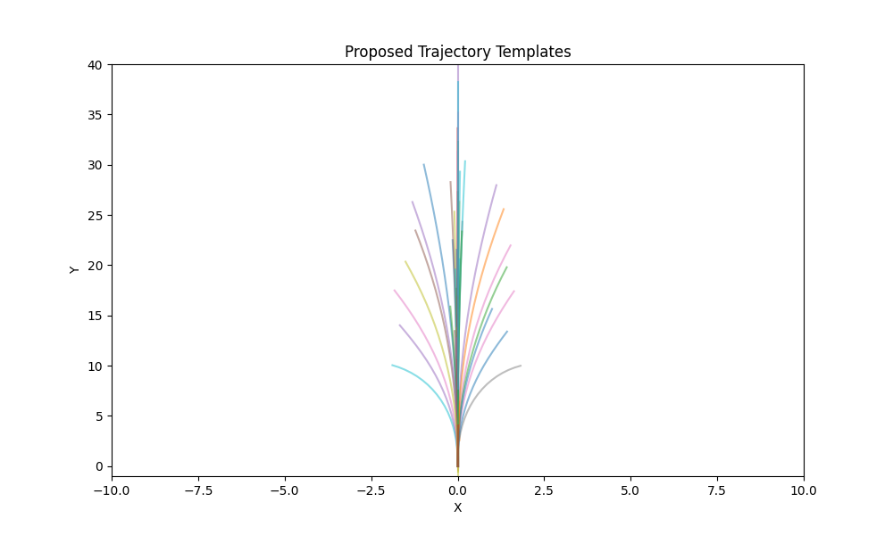
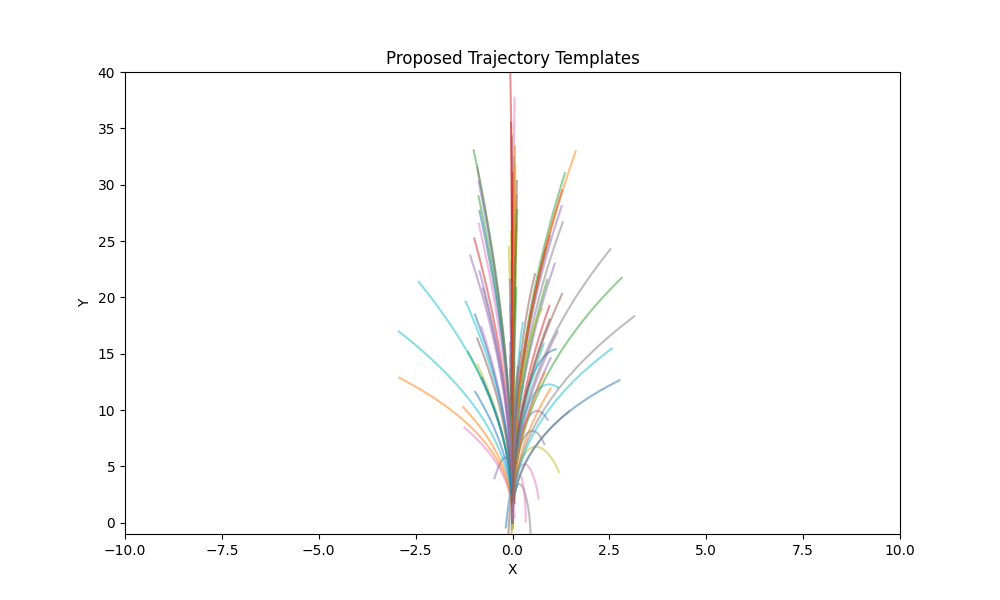
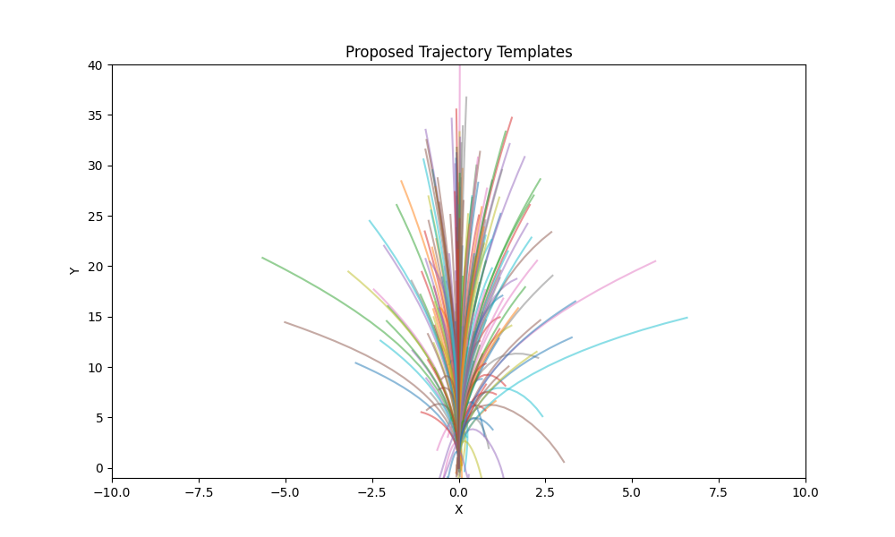

# DriveLLaVA



[](https://github.com/AdityaNG/DriveLLaVA/actions/workflows/main.yml)

TLDR: Using Large Vision Models as Driving Agents for AVs.

We trained LLaVA on the CommaVQ dataset to produce a tokenized driving signal.
The concept is simple:
- Take a Large Vision Model: LLaVA
- Implement a mechanism to intelligently quantize the vehicle trajectory (desired driving signal) into tokens
- Generate a dataset of <Driving Frame, Trajectory Token> pairs
- Fine-tune DriveLLaVA to predict the correct Trajectory Token given the Driving Frame(s) as input

The idea is to take advantage of the world model that an LLM would already have to make a driving agent.
Above is a demo of the DriveLLaVA predicting (BLUE) trajectory tokens and the GT trajectory (Green) after it was trained on a 10% subset of the dataset (300k pairs).

## Results



| Metric | Value |
|----------------------|-------------------------|
| Runtime | 23,305.34 seconds |
| Training loss | 0.722 |
| Global step | 4150 |
| Steps per second | 1.173 |
| Samples per second | 4.692 |
| Evaluation runtime | 63.93 seconds |
| Evaluation loss | 0.768440842628479 |
| Epochs | 0.25 |
| Initial Learning rate | 2e-8 |
| Final Learning rate | 1.7627e-8 |


The [training](https://wandb.ai/adityang/huggingface/runs/apo0hyvv) proceeds smoothly for an initial learning rate of `2e-8` and a batch size of `16`. This consumed around `38 GB` VRAM and ran for about `6h30m` on an A100 on Google Colab.


# Getting Started

This is a public repo and we are open to contributons! Feel free to raise a PR for a feature or bugfix. Please read our [CONTRIBUTING.md](CONTRIBUTING.md) for more details on how to contribute! Use the below steps to get started with a local environment setup for development!

## Environment Setup

Use the docker compise build to setup the environment.

```bash
cd ~/
git clone https://github.com/AdityaNG/DriveLLaVA

cd ~/DriveLLaVA

sudo docker compose build

python3 -m drivellava.scripts.train
python3 -m drivellava.scripts.eval
```

## Downloading Dataset

Get started by downloading the CommaVQ Trajectory dataset from HuggingFace.
Then setup the DriveLLaVA repository.

```bash
cd ~/Datasets/
GIT_LFS_SKIP_SMUDGE=1 git clone https://huggingface.co/datasets/AdityaNG/commavq-trajectory ~/Datasets/commavq

cd ~/Datasets/commavq
git lfs pull
unzip "*.zip"
```

## Generating Trajectory Tokens

We quantize the trajectory by fitting a K-Means clustering model on the dataset, which was inspired by TrajNet. The quantized index is then mapped to a Unicode character by using a lookup into the Model's Dictionary which is saved in `media/vocab.json`. This is implemented in `drivellava/trajectory_encoder.py`. Following is an example frame from the Trajectory Dataset we put together. We have selected Language Tokens that were not used frequently in an attempt to remap them to trajectory tokens. We were aware that it is possible to add new tokens to the model's dictionary, we elected to not go down that route for simplicity. In order to ensure some diversity in the prompts, we use an LLM to generate various versions of the same prompt with different words as shown in `drivellava/sparse_llava_dataset.py` in the `get_drivellava_prompt(...)` function.

```json
{
  "id": "10009100841",
  "image": "img_val/b57ccb9f2a966667dfe6c831ae88dca7_410/841.png",
  "conversations": [
    {
      "from": "human",
      "value": "<image> You, as DriveLLaVA, are at the forefront of 
        autonomous navigation. Assess the situation depicted in the 
        image and select the trajectory that best aligns with safe and 
        efficient driving principles from the options provided. The 
        trajectory tokens are sorted from left to center to right
        Left: ̂,ペ,何,宇,張
        Center: 语,老,例,Ṭ,鉄
        Right: 克,☉,™,ɹ,ἱ,ⴰ\n"
    },
    {
      "from": "gpt",
      "value": "Selected Trajectory: 宇"
    }
  ]
}
```

Below are the scripts used to generate the dataset. Note that these are already generated in the huggingface dataset we have provided, so you can skip this step if you wish to use the dataset we have provided. If you want to generate a custom dataset, you will need to set the `NUM_TRAJECTORY_TEMPLATES` in `trajectory_encoder.py` and then run the following scripts.

```bash
# Set the NUM_TRAJECTORY_TEMPLATES in drivellava/trajectory_encoder.py
python3 -m drivellava.scripts.generate_trajectory_templates
python3 -m drivellava.scripts.generate_sparse_llava_dataset_parallel
python3 -m drivellava.scripts.compile_jsons
```

## Quantized Trajectory

We quantize the trajectory by fitting a K-Means clustering model on the dataset to produce the following trajectory templates. We set experiment with setting K to 64, 128 and 256.

| K | Quantized Trajectories |
|----------------------|-------------------------|
| 64 |  |
| 128 |  |
| 256 |  |


## Running the scripts

The CommaVQ dataset consists of image embeddings. We re-generate the original images for a subset of the dataset using the image decoder provided by Comma.
```bash
python3 -m drivellava.scripts.generate_commavq_images
```

To visualize the dataset, use the below command.
```bash
python3 -m drivellava.scripts.visualize_pose
```

To train and then eval the model, run the following. Note that you will need to run `wandb login` before this step if you want to use Weights & Biases for logging
```bash
python3 -m drivellava.scripts.train
python3 -m drivellava.scripts.eval
```

Merge the model
```bash
cd LLaVA/
python scripts/merge_lora_weights.py \
  --model-path /path/to/lora_model \
  --model-base /path/to/base_model \
  --save-model-path
```

Setup the docker container for training
```bash
docker compose run dev
```

Launching Carla
```bash
CUDA_VISIBLE_DEVICES=0 ./CarlaUE4.sh -quality-level=Low -prefernvidia -ResX=10 -ResY=10
```

Generate the simple trajectory templates
```bash
python3 -m drivellava.scripts.generate_trajectory_templates_simple
```

Running the carla client
```bash
python3 -m drivellava.scripts.carla_run
```

## Development

Read the [CONTRIBUTING.md](CONTRIBUTING.md) file.

## Tasks

- [x] Training script
  - [x] Select what layers to train
  - [x] Measure memory requirements: ~ 40 GB vRAM
  - [x] [Notebook training Script](DriveLLaVA.ipynb)
  - [x] Train on CommaVQ
  - [x] Tabulate results
- [x] Dataset
  - [x] Generate images from CommaVQ
  - [x] Denoise the trajectory
  - [x] Quantize the trajectory
  - [x] Visualize the trajectory on the image
  - [x] Generate JSON dataset
- [ ] Carla
  - [x] Build a Carla Client
  - [x] Connect Vision Model to Carla
  - [ ] Pause sim when thinking
  - [ ] Feed in multi-cam input
  - [ ] Feed in top down map view
- [ ] CI and Features
  - [ ] There's a lot of issues with the sanity of the dataset since the trajectory was derived from accelerometer data. Find out how to filter out bad data without affecting the distribution of data. Write test cases to enforce
  - [ ] Write test cases for the following scripts
    - [ ] generate_trajectory_templates
    - [ ] generate_sparse_llava_dataset_parallel
    - [ ] generate_sparse_llava_dataset
    - [ ] compile_jsons
  - [ ] Integrate the `LLaVA/` folder inside `drivellava/`
  - [ ] Push to pypi through github actions
  - [ ] Push docker image to docker hub through github actions
  - [ ] MLOps on Github Actions: training to auto trigger after PR merges
- [ ] Model Experiments
  - [ ] Temporal Information: Feed the model more than 1 frame of context
  - [ ] Temporal Consistency loss: Penalize the model for producing temporally inconsistent results

## References

- Credits to the LLaVA repo: https://github.com/haotian-liu/LLaVA
- Fine-tuning LLaVA: https://ubiai.tools/how-to-fine-tune-llava-on-your-custom-dataset/
- TrajNet for quantized Trajectories: https://adityang.github.io/TrajNet
- Wayve's LINGO-1 as an Inspiration: https://wayve.ai/thinking/lingo-natural-language-autonomous-driving/'
